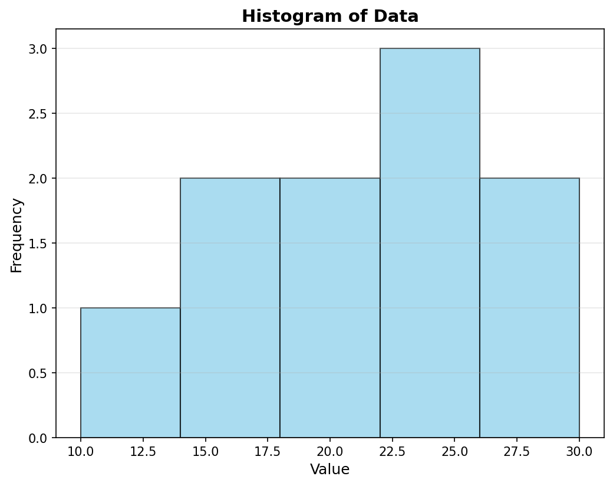
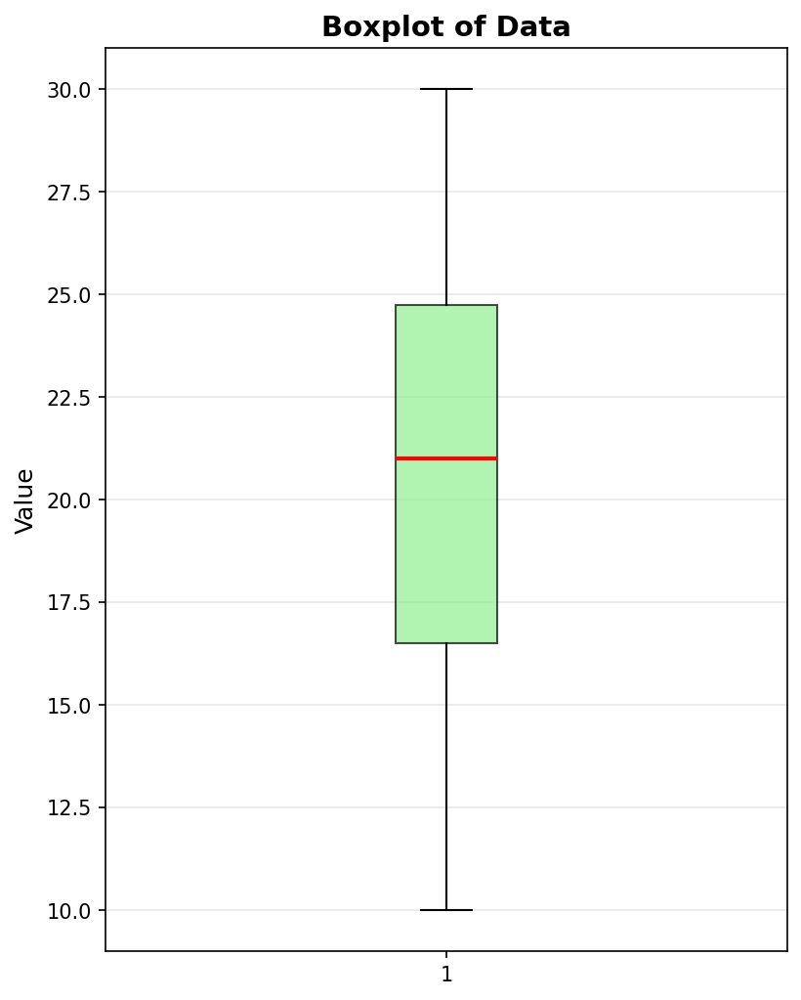

# 통계 분석 결과

## 1. 기본 통계량

데이터를 분석한 결과는 다음과 같습니다:

### 결과:
- **평균 (Mean)**: 20.80
- **중앙값 (Median)**: 21.00
- **표준편차 (Standard Deviation)**: 6.16
- **최솟값**: 10
- **최댓값**: 30
- **범위 (Range)**: 20

## 2. 시각화

### 히스토그램
데이터의 분포를 보여주는 히스토그램입니다:

### 박스플롯
데이터의 사분위수와 이상치를 확인할 수 있는 박스플롯입니다:

## 3. 결과 해석

### 데이터 분포 특성
- **중심 경향**: 평균(20.80)과 중앙값(21.00)이 거의 유사하여, 데이터가 **대칭적**으로 분포되어 있음을 시사합니다.
- **변동성**: 표준편차가 6.16으로, 평균의 약 30%에 해당하여 데이터가 적당히 퍼져있습니다.
- **범위**: 최솟값 10에서 최댓값 30까지 20의 범위를 가집니다.

### 이상치 분석
박스플롯을 통한 이상치 판단 (IQR method):
- **Q1 (1사분위수)**: 16.0
- **Q3 (3사분위수)**: 25.0
- **IQR (사분위 범위)**: 9.0
- **이상치 범위**: [Q1 - 1.5×IQR, Q3 + 1.5×IQR] = [2.5, 38.5]

**결론**: 모든 데이터 포인트가 이상치 범위 내에 있으므로 **이상치 없음**

### 데이터 특징 요약
- 정규분포에 가까운 대칭적 분포
- 극단적인 값 없음
- 적절한 수준의 변동성
- 샘플 크기가 작아(n=10) 추가 데이터 수집 권장

