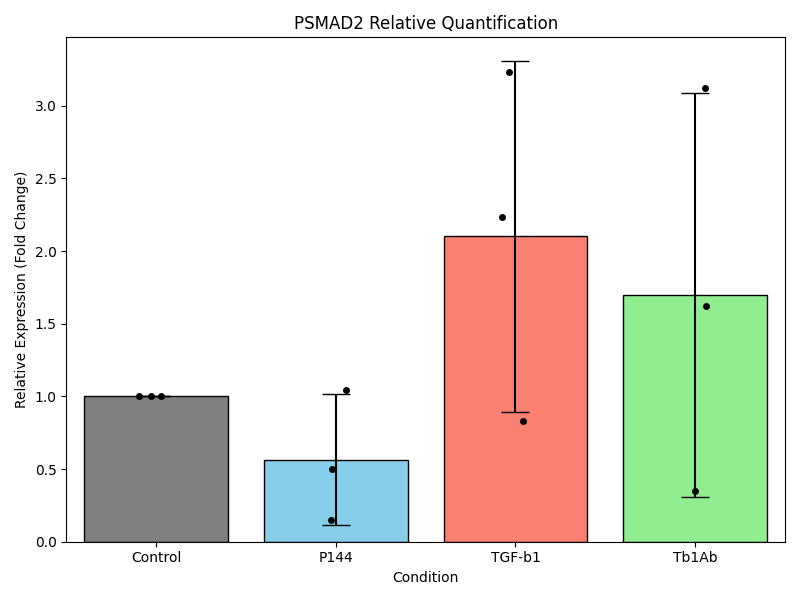

### Western Blot Analysis: PSMAD2 Quantification

I have successfully analyzed the Western blot image `wb_full.png` to quantify PSMAD2 expression levels across three experimental repetitions and four conditions (Control, P144, TGF-β1, Tβ1Ab).

#### **1. Methodology**
- **ROI Detection**: A manual grid was applied to accurately segment the 36 bands (3 targets × 4 conditions × 3 repetitions) after automated detection proved inconsistent due to varying band intensities.
  - **Grid Verification**: `wb_grid_verification.png` confirms the correct placement of ROIs over the bands.
- **Quantification**: Band intensities were measured for PSMAD2, SMAD2, and GAPDH.
- **Normalization**:
  - **Step A**: SMAD2 intensity was normalized to GAPDH ($SMAD2_{norm} = SMAD2 / GAPDH$).
  - **Step B**: PSMAD2 intensity was normalized to the result of Step A ($Target_{value} = PSMAD2 / SMAD2_{norm}$).
  - **Fold Change**: Values were normalized to the 'Control' condition within each repetition.

#### **2. Results**

**Relative Expression (Fold Change vs Control):**

| Condition | Mean Fold Change | Standard Deviation |
|-----------|------------------|--------------------|
| **Control** | 1.00 | 0.00 |
| **P144** | 0.56 | 0.45 |
| **TGF-β1** | 2.10 | 1.21 |
| **Tβ1Ab** | 1.70 | 1.39 |

**Key Findings:**
- **TGF-β1** treatment increased PSMAD2 levels by approximately **2.1-fold** compared to control.
- **P144** treatment reduced PSMAD2 levels to **0.56-fold** (approx. 44% reduction).
- **Tβ1Ab** treatment showed an increase to **1.70-fold**, though with high variability across repetitions.

#### **3. Visualization**
The bar graph below illustrates the mean relative expression with error bars representing the standard deviation. Individual data points (black dots) show the variability between the three repetitions.

**Generated Files:**
- `psmad2_quantification.png`: Bar graph of relative quantification.
- `wb_grid_verification.png`: Image showing the grid of ROIs used for quantification.